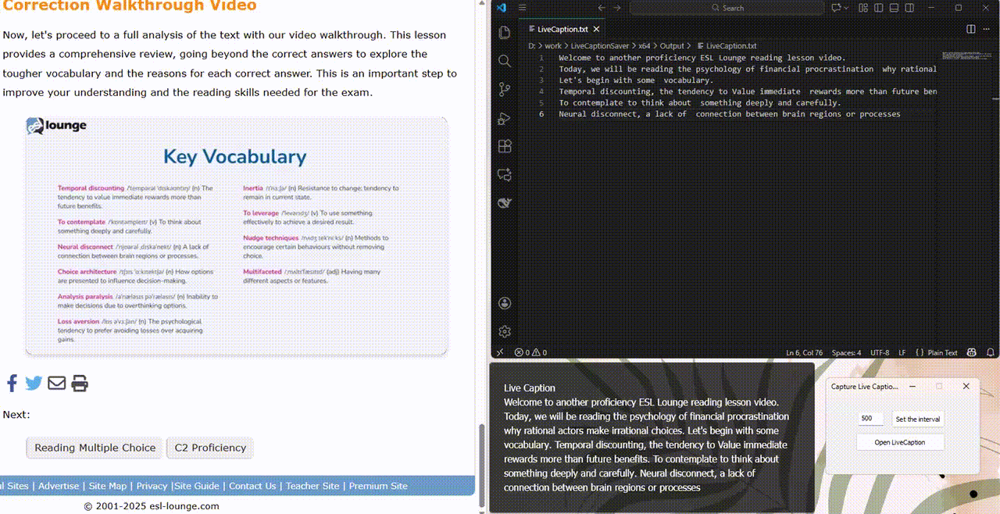

# 🗣️ Real-Time Voice-to-Text Translator

A powerful C++ application that captures live audio (like Chrome Live Captions) and converts it to text in real time — ideal for accessibility, meeting notes, interviews, or AI-assisted conversations.  
Translate speech instantly, save transcripts automatically, and connect with GPT-based tools for smart analysis.

# 👋 Hi, I'm Jeremy Arellano

🚀 **AI/ML Engineer | Software Developer | .NET / C++ / Java Specialist**

I'm passionate about creating scalable, intelligent, and accessible applications that bridge technology and human needs.  
Currently working on **AI-driven accessibility tools** and real-time applications using modern frameworks.

## 🧠 About Me

- 💼 Software Engineer experienced in **C++, C#, Java, and .NET Framework**
- 🤖 Enthusiastic about **AI/ML applications**, automation, and assistive technology
- 💡 Focused on transforming ideas into high-impact software solutions

## 🚀 How It Works

1. Ensure **Live Captions** are enabled in Chrome.
2. Run the C++ app to capture captions from media in Chrome, including GPT-powered interviews.
3. The app automatically processes the captions and displays them as text in real-time.
4. Optionally, save the text or copy it for further use!

## 💡 Use Cases

- **Job Interviews**: Capture real-time captions from AI-assisted interviews with GPT or other platforms, making it easier to review and follow up on questions.
- **Content Creators**: Quickly save captions from online videos for script writing or analysis.
- **Accessibility**: Enhance accessibility by converting captions into text for users who need text-based content.
- **Language Learners**: Capture and review spoken content to aid in language transcription and learning.
- **Developers & Researchers**: Use captured text for speech-to-text projects or natural language processing (NLP) experiments.

## 🔧 Technologies Used

- **C++**: Core language used for high-performance real-time text capture.
- **No OCR**: This tool extracts text directly from Chrome’s Live Caption pop-up window without using OCR, making it lightweight, fast, and fully local with no network traffic required.

## 📝 License

This project is licensed under the MIT License.

## 🌐 Keywords

**C++**, **Live-Caption**, **Text-Capture**, **Job-Interviews**, **GPT**, **Speech-to-Text**, **Chrome-API**, **Accessibility**, **Multi-Language-Support**, **Real-Time**,  **Audio-To-Text**,  **Voice-To-Text**,  **Speech-Recognition**,  **Audio-To-Text**, **Transcription**, **caption-generator**

## 🧭 Goals for 2025

- 🚀 Launch 3 open-source AI or .NET projects  
- 💬 Share tech insights via blog posts  
- 🎯 Contribute to accessibility-focused open-source tools  

⭐️ *If you find my work useful, please consider giving a star!*

© 2025 Jeremy. All rights reserved.

